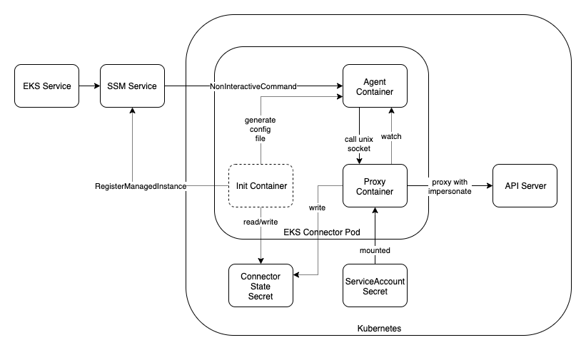

# EKS Connector

EKS Connector is a client-side agent that connects any Kubernetes cluster to AWS. 

## How it works

EKS Connector runs in Kubernetes as a Pod that consists of below containers:



### init container

The init container is responsible for initiating the state of EKS Connector.

### proxy container

The proxy container is responsible for proxying Kubernetes API Server traffic and applying appropriate
user-impersonation flow.

### agent container

The agent container runs
the [AWS System Manager Agent](https://docs.aws.amazon.com/systems-manager/latest/userguide/ssm-agent.html). It
maintains a persistent, secure connection between the Kubernetes cluster and AWS.

AWS SSM agent is published at [ECR Public](https://gallery.ecr.aws/amazon-ssm-agent/amazon-ssm-agent) 

## Development

### Install from repo

Run the following command against the cluster after retrieving your activation code and id. See the guide 
[here](https://docs.aws.amazon.com/eks/latest/userguide/connecting-cluster.html).

```shell
$ helm -n eks-connector install eks-connector \
    oci://public.ecr.aws/eks-connector/eks-connector-chart \
    --set eks.activationCode="<your-activation-code>" \
    --set eks.activationId="<your-activation-id>" \
    --set eks.agentRegion="<your-region>"
```

### Updating dependencies

- `GOPROXY=direct go get -t <module>`
- `go mod vendor`
- development with new dependency
- `go mod tidy`
- commit vendor folder changes in a dedicated CR for easier review
- commit code changes in follow-up CR

## Release

Amazon EKS Connector build is released at [ECR Public](https://gallery.ecr.aws/eks-connector/eks-connector). 

## Test

To deploy it we need to create an SSM hybrid activation first.
__For testing, put a high number of activation instance__ so that we don't need to create activation often when SSM
agent restarts.

```bash
# Fill in the activation ID and activation code.
export EKS_ACTIVATION_ID=""
export EKS_ACTIVATION_CODE=""
export EKS_AWS_REGION=""
# Replace with your custom built images if needed
export EKS_CONNECTOR_IMAGE="public.ecr.aws/eks-connector/eks-connector:0.0.3"
export SSM_AGENT_IMAGE="public.ecr.aws/amazon-ssm-agent/amazon-ssm-agent:3.1.1927.0"

# Apply the manifest
sed "s~%AWS_REGION%~$EKS_AWS_REGION~g; s~%EKS_CONNECTOR_IMAGE%~$EKS_CONNECTOR_IMAGE~g; s~%SSM_AGENT_IMAGE%~$SSM_AGENT_IMAGE~g; s~%EKS_ACTIVATION_ID%~$EKS_ACTIVATION_ID~g; s~%EKS_ACTIVATION_CODE%~$(echo -n $EKS_ACTIVATION_CODE | base64)~g" \
    ./manifests/eks-connector.yaml | kubectl apply -f -
# After a few seconds the connector pod should be healthy in kubernetes.

# Now get the managed instance at SSM.
aws ssm describe-instance-information --filters Key=ActivationIds,Values=$EKS_ACTIVATION_ID
# If you are lucky you should see exactly one managed instance.
# Alternatively, grep the logs at init container, which should print out the instance id.

# Now execute non interactive command
# NOTE: fill in TARGET with your own managed instance id like `mi-069f7e4b6ce64c0ce`
aws ssm start-session \
    --target TARGET \
    --document-name AWS-StartNonInteractiveCommand \
    --parameters '{"command": ["curl --unix-socket /var/eks/shared/connector.sock -H \"x-aws-eks-identity-arn: arn:aws:iam::123456789012:user/test-user\" http://localhost/api/v1/pods"]}'
```

### Cleanup

Just delete with the manifest

```bash
sed "s~%AWS_REGION%~$EKS_AWS_REGION~g; s~%EKS_CONNECTOR_IMAGE%~$EKS_CONNECTOR_IMAGE~g; s~%SSM_AGENT_IMAGE%~$SSM_AGENT_IMAGE~g; s~%EKS_ACTIVATION_ID%~$EKS_ACTIVATION_ID~g; s~%EKS_ACTIVATION_CODE%~$(echo -n $EKS_ACTIVATION_CODE | base64)~g" \
    ./manifests/eks-connector.yaml  | kubectl delete -f -
```

## Security

See [CONTRIBUTING](CONTRIBUTING.md#security-issue-notifications) for more information.

## License

This project is licensed under the Apache-2.0 License.

